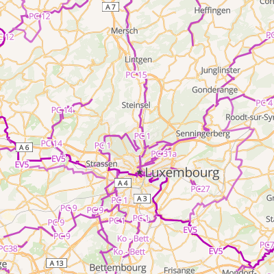
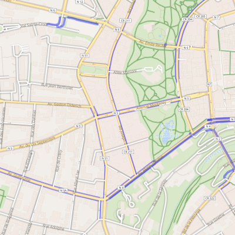

# Teritorio Bicycle Style

Derived from [OSM Bright](https://github.com/openmaptiles/osm-bright-gl-style)

A Mapbox GL Bicycle map build on OpenStreetMap and [OpenMapTiles](https://github.com/openmaptiles/openmaptiles).

## Teritorio Styles Family

- [OSM Bright](https://github.com/openmaptiles/osm-bright-gl-style)
    - [Teritorio Basic](https://github.com/teritorio/teritorio-basic-gl-style)
        - [Teritorio Tourism](https://github.com/teritorio/teritorio-tourism-gl-style) (Tourism thematic POIs, large icon)
            - [Teritorio Tourism Basic](https://github.com/teritorio/teritorio-tourism-basic-gl-style) (small icon)
        - [Teritorio City](https://github.com/teritorio/teritorio-city-gl-style) (City thematic POIs, large icon)
            - [Teritorio City Basic](https://github.com/teritorio/teritorio-tourism-basic-gl-style) (small icon)
        - [Teritorio Bicycle](https://github.com/teritorio/teritorio-bicycle-gl-style) (Network and Facilities)

## Preview





## Edit the Style

Use the [Maputnik CLI](http://openmaptiles.org/docs/style/maputnik/) to edit and develop the style.
After you've started Maputnik open the editor on `localhost:8000`.

```
maputnik --watch --file style.json
```

## Depencency

This style require at least the Mapbox GL JS version 1.10.1.
